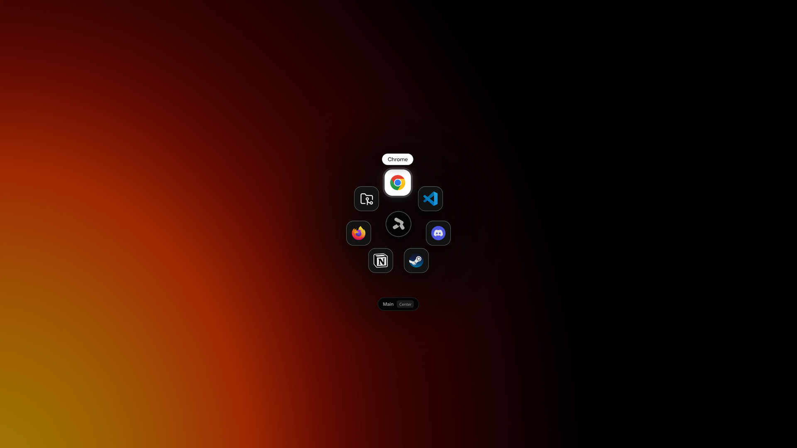
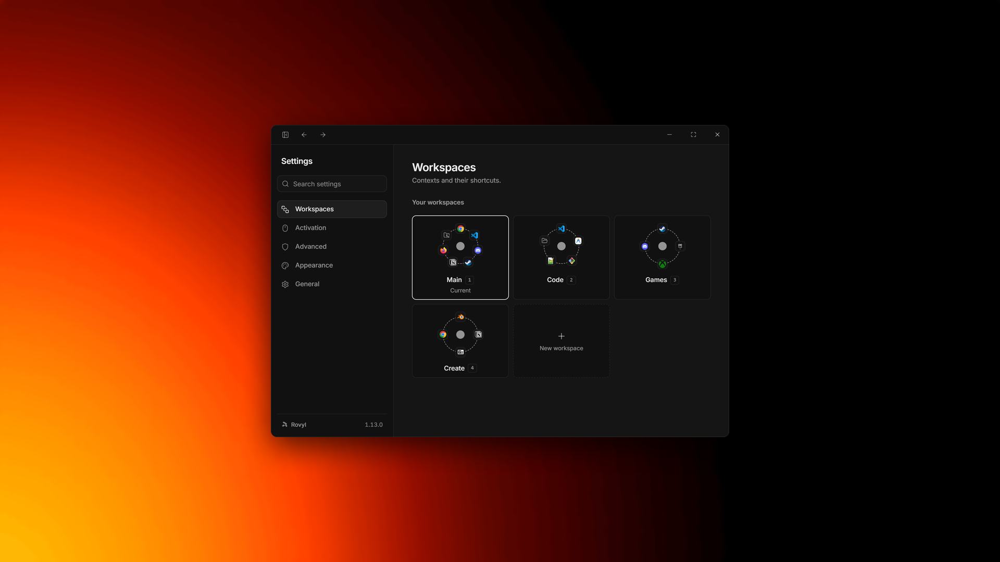
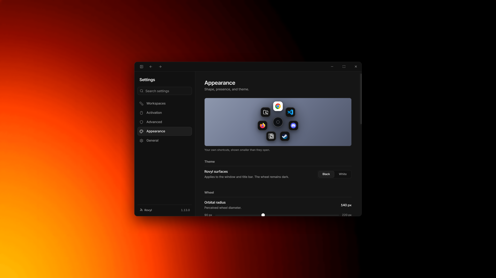

<div align="center">

# Rovyl

**ひと振りで、どこへでも。**

Windows のためのラジアルランチャー。どこでもマウスの中ボタンを長押しし、狙って、離すだけ。

[English](README.md) · **日本語**

[](https://github.com/arshit09/rovyl/releases/latest)


</div>

---

## なぜ

どのランチャーも、まず今していることを中断させます。ウィンドウを開き、何文字か打ち、一覧を読み、行を選ぶ。速くはあっても、やはり中断ですし、手はマウスから離れます。

Rovyl は別の賭けに出ています。**あなたは自分のものがどこにあるか、もう知っている。** 中ボタンを長押しすると、画面の真ん中にホイールが咲きます。欲しいものの方へ動かし、離す。全部で 1 秒もかからず、いま居た場所でそのまま起き、あなたと作業のあいだにウィンドウを挟みません。

<div align="center">

</div>

## できること

- **どんな画面の上にも** — 全画面のアプリを含め、どのウィンドウの上でも開きます
- **モニターの選択** — 常にメイン画面か、ポインターのある画面か
- **なんでも起動** — アプリケーション、フォルダー、ファイル、ウェブサイト、自由なコマンド
- **自動で見つける** — スタートメニューを読み、アプリの本物のアイコンを取り出します
- **ワークスペース** — 仕事用、ゲーム用、配信用とホイールを分け、数字キーで切り替え
- **呼び出し方は自由** — マウスの中ボタン、サイドボタン、あるいはグローバルホットキー
- **2 つの狙い方** — 速さなら向きで、正確さならポインターで
- **クリックなしで起動** — 任意。ポインターを隠し、向きで選び、そのまま開きます
- **フォーカスの保護** — 全画面のゲーム中は邪魔をしません
- **完全オフライン** — アカウントなし、計測なし、広告なし。あなたの PC から何も出ていきません

## インストール

<div align="center">

[](https://github.com/arshit09/rovyl/releases/latest)

**Windows 10 と 11 — 無料、アカウント不要、登録するものは何もありません。**

</div>

ボタンを押すと GitHub の最新リリースが開きます。GitHub からダウンロードしたことがなくても、手順は 4 つだけです。

1. **Assets** の下にある **`.exe`** で終わるファイルをクリックします。ほかのファイルと同じように `Downloads` フォルダーに保存されます。
2. ブラウザーのダウンロードバーから、または `Downloads` でダブルクリックして開きます。
3. このインストーラーには署名がないため、Windows が青い **「Windows によって PC が保護されました」** の画面を出します。**詳細情報** をクリックし、**実行** を選んでください。
4. インストーラーに従います。あとは Rovyl が通知領域に常駐し、このリポジトリから自分で更新するので、手動のダウンロードはこの一度きりです。

**ソースから** — 下の [ビルド](#ビルド) を参照してください。

## 使い方

<table>
<tr>
<td width="50%" valign="top">

**長押し**

Windows のどこでも、マウスの中ボタンを押したままにします。画面が暗転してホイールが現れ、どの向きへひと振りしてもすべてのショートカットに届きます。既定では中央に開きますが、「外観」→ **開く位置** でポインターの下に出すこともできます。モニターが 2 枚あるなら、「呼び出し」→ **ディスプレイ** で **メイン画面** と **ポインターを追う** を選べます。

</td>
<td width="50%" valign="top">

**狙う**

欲しいショートカットの方へ動かします。方向モードでは、画面のどこからでも指した扇形が光ります。面積モードも同じように振る舞い、各項目の取り分を描き分けます。ポインターモードでは、カーソルの下のアイコンだけが光ります。キーボード起動を有効にすれば、数字キーで扇形を直接選べます。

</td>
</tr>
<tr>
<td valign="top">

**離す**

対象が開き、ホイールは消えます。中央で離すか Escape を押せば、何も起動せずに取り消せます。

</td>
<td valign="top">

**切り替える**

既定では、ホイールは最初にワークスペースの選択画面を開きます。数字キーの方が好みなら、「一般」→ **ワークスペースの切り替え** → **キー**。ホイールが開いているあいだ、1〜9 で移動できます。

</td>
</tr>
</table>

## スクリーンショット

<div align="center">


</div>

## ビルド

**Windows 10 または 11** と **Node 20 以上** が必要です。Windows 専用なのは設計です。呼び出し、アイコンの取り出し、ウィンドウの扱いのいずれも Win32 の振る舞いに依存しています。

```bash
git clone https://github.com/arshit09/rovyl
cd rovyl
npm install
npm start
```

`npm start` は `dist/` が無ければ一度ビルドし、本番用のレンダラーを Electron で動かします。開発サーバーは挟みません。ホットリロードが要るなら `npm run start:dev` が Vite を立ち上げ、その準備ができてから Electron を起動します。別々に動かすなら `npm run dev` と `npm run electron`。実際にインストールされた状態でしか存在しないもの（たとえば更新機能）を触るには `npm run start:packaged` を使ってください。インストーラーを作らずにパッケージ化して起動します。

Google サインインには自分の資格情報が必要です。`.env.example` を `.env.local` にコピーし、自分の Google Cloud プロジェクトのクライアント ID を入れてください。既定値は意図的に置いていません。フォークが他人の OAuth クライアントを受け継がないようにするためです。

> 開発中のアプリとパッケージ版は `%APPDATA%\Rovyl` を共有します。Electron がこのパスを `productName` から決めるためです。つまり開発セッションは、あなたの実際の設定を読み書きします。まっさらなプロファイルで作業するには `--user-data-dir` を渡してください。

<details>
<summary><b>スクリプト一覧</b></summary>

| コマンド | 何をするか |
| --- | --- |
| `npm start` | 本番ビルドを Electron で。必要なら先にビルドします |
| `npm run start:dev` | Vite 開発サーバー ＋ Electron |
| `npm run start:packaged` | インストーラー無しでパッケージ化し、`%LOCALAPPDATA%` に置いて起動 |
| `npm run dev` | Vite のみ |
| `npm run electron` | Electron のみ。ポート 5173 を待ちます |
| `npm run build` | ネイティブヘルパー → `tsc` → Vite ビルド → ラジアルとレンダラー予算の検査 → アイコンとストア用素材 |
| `npm run dist` | `build` ＋ electron-builder。インストーラーは `build-out/` |
| `npm run dist:store` | `build` ＋ electron-builder。ストア向けの MSIX パッケージ |
| `npm run release` | リリースを切ります（`release:check` で空打ち） |
| `npm run verify:radial-windowing` | ホイールと設定のウィンドウ分割の不変条件を確認します |
| `npm run verify:renderer-budget` | ホイールのバンドルを予算内に保ちます |
| `npm run test:window-split` | 使い捨てのプロファイルで実物を起動し、ホイールを開きます |
| `npm run test:win32-launch` | コマンドの解析と引用符の扱い |
| `npm run test:persistence-shape` | 永続化データの正規化 |
| `npm run test:i18n` | 翻訳テーブルのキー整合と内容 |
| `npm run test:i18n-packs` | ホイールとエラーカードの言語パック |
| `npm run test:backend-i18n` | メインプロセス側の文言テーブル |

`package.json` にあるその他の `test:*` は、機能ごとの的を絞ったスモークテストです。

</details>

## コントリビュート

Issue と Pull Request を歓迎します。一見すると恣意的に見えるものを変える前に、**[docs/ARCHITECTURE.md](docs/ARCHITECTURE.md)** を読んでください。その大半は何かが壊れた結果として存在していて、理由が書き残されています。

先に知っておくとよいことが 2 つあります。コードのコメントは *何を* ではなく *なぜ* を説明していること。そして `npm run build` が、ホイールのウィンドウ契約とバンドル予算を強制する検証スクリプトを走らせることです。どれかが落ちたときは、テストではなく契約が壊れています。

## リンク

- **ダウンロード** — [最新リリース](https://github.com/arshit09/rovyl/releases/latest)
- **サイトとドキュメント** — [rovyl-red.vercel.app/ja](https://rovyl-red.vercel.app/ja)
- **すべてのリリース** — [github.com/arshit09/rovyl/releases](https://github.com/arshit09/rovyl/releases)
- **上流** — [HenryCauan/rovyl](https://github.com/HenryCauan/rovyl)
- **プライバシーポリシー** — [rovyl-red.vercel.app/ja/privacy](https://rovyl-red.vercel.app/ja/privacy)

## ライセンス

Copyright © 2026 Henry Cauan.

Rovyl はフリーソフトウェアであり、**GNU General Public License v3.0** のもとで提供されています（[LICENSE](LICENSE) を参照）。使用、研究、改変、共有ができます。改変版を配布する場合は、そのソースを同じライセンスで公開する必要があります。

著作権者はこの送出ライセンスに拘束されないため、Microsoft Store で販売されるビルドは Microsoft の標準的な条項のもとで配布されています。どちらも同じコードです。
